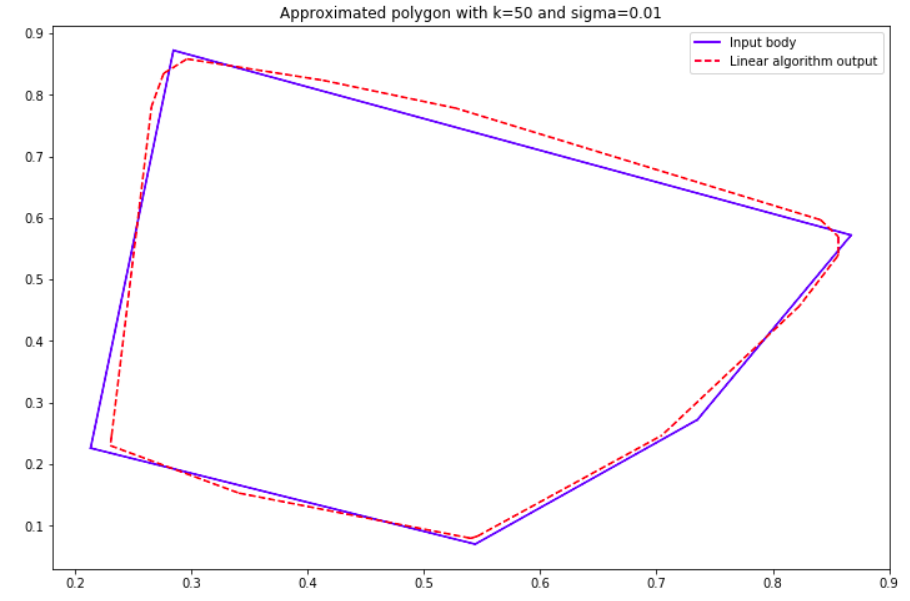
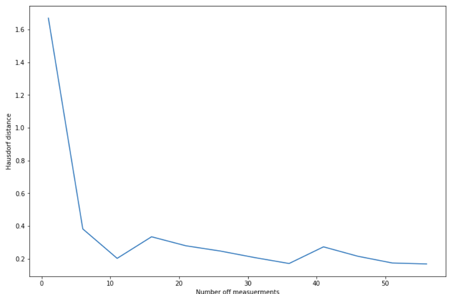

# Convex_Body_Reconstruction
### A Python implementation of convex body reconstruction algorithms described in ["A New Algorithm for 3D Reconstruction from Support Functions"](https://www.researchgate.net/publication/23791824_A_New_Algorithm_for_3D_Reconstruction_from_Support_Functions) paper by Richard J. Gardner and Markus Kiderlen. 
****

#### This Repo includes
* 2D implementation of a linear program version described in paper.
* Convex body generation and visualization scrips
* Utils for plotting and visualizing experiments

*The results of a linear program version you can see in Reconstruction_from_support_function notebook*
*implemented only for 2D case*

**Reconstruction a input polygon from 50 measurements, with 0.01 noise level.**

**Reconstruction error(Hausdorf distance) versus number of measurements.**

